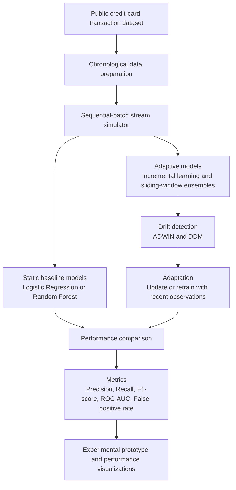

# SentinelFlow

SentinelFlow is an experimental machine-learning project for real-time digital-payment fraud detection under concept drift. It compares static and adaptive fraud models to determine how reliably they identify fraud as transaction behavior evolves.

## Project Title

**Adaptive Stream Learning with Concept Drift Detection for Real-Time Digital Payment Fraud Detection**

## Problem

Digital payment systems must detect suspicious transactions quickly while minimizing false alerts for legitimate customers. Fraud patterns and cardholder behavior change over time, causing static models trained on historical data to degrade. SentinelFlow evaluates whether adaptive stream-learning and drift-detection methods maintain performance more effectively than static models.

## Objectives

- Simulate a chronological stream of credit-card transactions.
- Compare static and adaptive fraud-detection models.
- Monitor changing transaction behavior and detect concept drift.
- Adapt models after significant stream changes.
- Report precision, recall, F1-score, ROC-AUC, and false-positive rate.

## Project Flowchart



## Approach

1. Prepare a public, anonymized credit-card transaction dataset and retain its chronological order.
2. Train static baseline models using an initial historical window.
3. Deliver later transactions in sequential batches that emulate a live stream.
4. Run static and adaptive models side by side.
5. Use ADWIN and DDM to identify significant stream changes.
6. Update or retrain adaptive models using recent observations after detected drift.
7. Compare performance across successive time windows.

The project focuses on an experimental prototype. It excludes production deployment, live banking infrastructure, customer identity verification, and live transaction blocking.

## Planned Technology

### Emerging technologies

- Dynamic risk features and entity profiling
- Adaptive windowing and drift detection with ADWIN
- Incremental learning and sliding-window ensembles

### Tools and languages

- OpenAI Codex for literature-review assistance, reference verification, code-generation support, and documentation drafting
- Python 3.11+ with pandas, NumPy, scikit-learn, River, Matplotlib, and Seaborn

## Planned Repository Layout

```text
sentinelflow-fraud-detection/
├── data/                 # Local or ignored datasets; never commit raw sensitive data
├── notebooks/            # Exploratory experiments
├── src/                  # Reusable pipeline code
├── tests/                # Automated tests
├── results/              # Metrics and generated figures
├── requirements.txt      # Python dependencies
└── README.md
```

## Dataset and Evaluation

The initial experiment will use the ULB/Kaggle Credit Card Fraud Detection dataset. It contains 284,807 anonymized transactions, including 492 fraud cases, and is highly imbalanced. [Dataset page](https://www.kaggle.com/datasets/mlg-ulb/creditcardfraud)

Primary evaluation metrics:

- Precision and recall
- F1-score
- ROC-AUC
- False-positive rate

Accuracy is not a primary metric because fraud transactions are rare.

## Development Plan

1. Set up the data pipeline and a chronology-safe train/validation/test split.
2. Implement Logistic Regression and Random Forest baselines.
3. Build the stream simulator and rolling-metric tracker.
4. Implement online models and ADWIN/DDM drift detection.
5. Add controlled drift experiments and adaptation logic.
6. Produce result plots, final report material, and demonstration workflow.

## Continuous Integration

GitHub Actions runs on every push and pull request. The workflow verifies that this README exists, compiles Python source files, and runs tests when a `tests/` directory is present.

## Team

- Sanjay Soralamavu Dev -- Leader
- Hemalasya Annapureddy -- Deputy Leader
- Abhipsa Panda
- Aravindan Chidambaram
- Mihir Rajpathak
- Mitansh Maheshwari
- Rovianty Nugracia
- Thanyathorn Limsuvattanaphong

## Status

Project planning and reference study are in progress. Implementation has not started yet.
